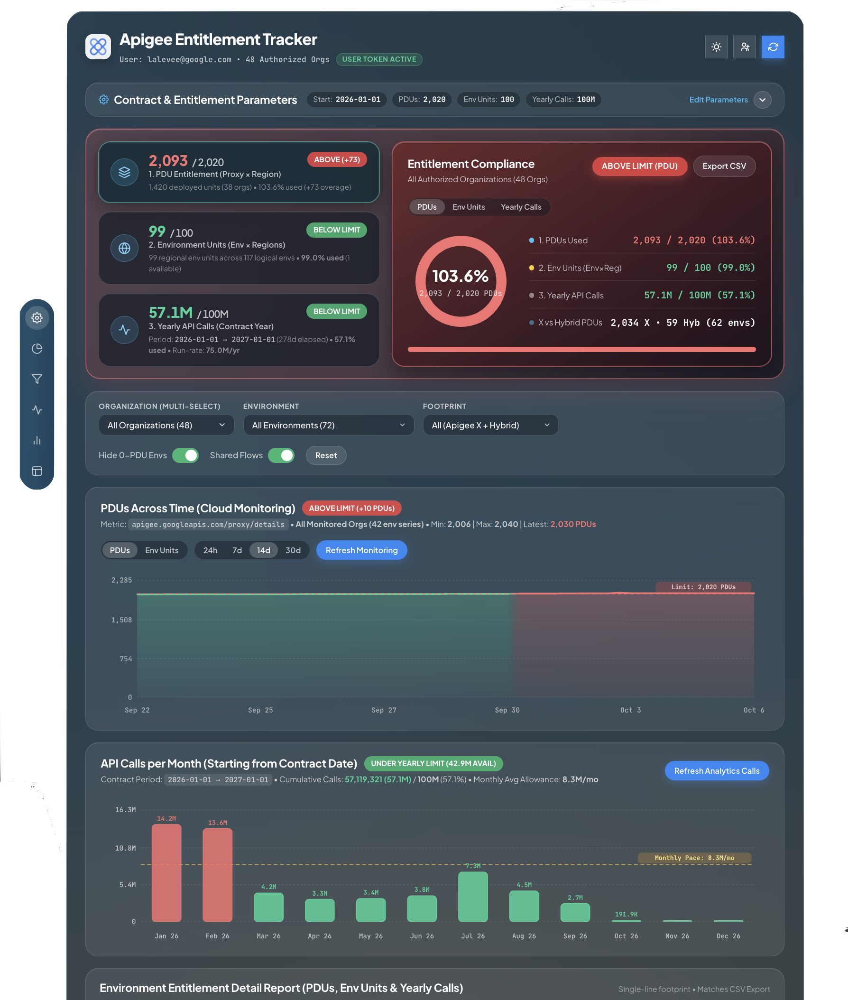
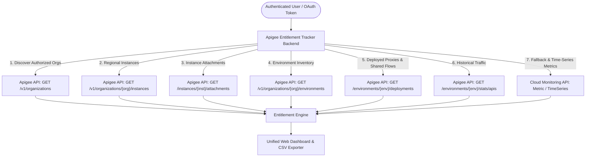

# Apigee Entitlement Tracker (Apigee X & Hybrid)

[](https://www.python.org/downloads/)
[](https://fastapi.tiangolo.com/)
[](https://opensource.org/licenses/Apache-2.0)
[](https://cloud.google.com/apigee)

**Apigee Entitlement Tracker** is an enterprise cross-organization capacity monitoring, entitlement audit, and compliance tracking application for **Google Cloud Apigee X** and **Apigee Hybrid**.

---

## 1. Problem Solved

### The Challenge: Cross-Organization Entitlement Tracking
In Google Cloud, Apigee subscription contracts (such as 2024 subscription plans) govern capacity across **multiple Apigee organizations and GCP projects**:
* **Proxy Deployment Units (PDUs)**
* **Environment Units (Environments &times; Attached Regions)**
* **Yearly API Call Commitments**

Enterprises typically manage several organizations across business units, environments (`dev`, `test`, `stage`, `prod`), and regions. In this cross-org context, it is extremely important to know overall subscription consumption and detect impending overages for PDU, Environments or calls.

### Unified Interface & Export Suite
**Apigee Entitlement Tracker** solves this by providing:
1. **Unified Single-Pane-of-Glass Interface**:
   * Automatically discovers all Apigee X and Hybrid organizations your Google identity is authorized to access.
   * Real-time compliance indicators and status badges (`WITHIN COMMITMENT`, `OVERAGE RISK`, `ABOVE LIMIT`) across all 3 entitlement dimensions.
   * Multi-organization and multi-environment filtering.
   * Visual time-series analytics for historical PDU capacity trends and monthly API call run-rate pacing over your active contract year.




2. **Structured Export Suite**:
   * One-click **Export CSV** generating a comprehensive, 12-column audit spreadsheet formatted for Google Sheets and Excel reporting.
   * Headless CLI mode for automated reporting and CI/CD audit jobs.

---

## 2. Where and How Information is Retrieved

### Data Sources & APIs
The application performs strictly **read-only** queries against two Google Cloud APIs:



1. **Apigee Management API (`apigee.googleapis.com/v1`)**:
   * **Organization Discovery**: Calls `GET /v1/organizations` using the caller's OAuth token to enumerate all organizations the user has access to.
   * **Regional Footprint & Attachments**: Queries `GET /v1/organizations/{org}/instances` and `/instances/{name}/attachments` to dynamically determine how many regions each environment is attached to (instance attachments).
   * **Environment Inventory**: Calls `GET /v1/organizations/{org}/environments` to inspect each environment.
   * **Deployments Inspection**: Calls `GET /v1/organizations/{org}/environments/{env}/deployments` to inspect every active proxy and shared flow revision, automatically classifying proxies as Standard or Extensible.
   * **Historical API Traffic**: Queries `GET /v1/organizations/{org}/environments/{env}/stats/apis?select=sum(message_count)` in optimized 90-day chunks across the 14-month Apigee Analytics window, measuring traffic since the configured **Contract Starting Date**.

2. **Cloud Monitoring API (`monitoring.googleapis.com/v3`)**:
   * Queries metric `apigee.googleapis.com/proxy/response_count` as an automatic fallback when the Analytics add-on is disabled on specific environments.
   * Queries historical capacity and traffic time-series for the visual monitoring charts.

---

### Entitlement Calculation Formulas

#### 1. Proxy Deployment Units (PDUs)
$$\text{Total PDUs} = \sum_{\text{Environments}} \left[ (\text{Deployed Proxies} + \text{Deployed Shared Flows}) \times \text{Attached Regions} \right]$$
* **Apigee X (`CLOUD`)**: Dynamically determines regional multipliers by querying instance attachments across each region.
* **Apigee Hybrid (`HYBRID`)**: Automatically handles hybrid clusters with customizable per-environment or per-organization region multipliers.
* **Artifact Classification**: Differentiates between Standard and Extensible proxies as well as deployed Shared Flows.

#### 2. Environment Units
$$\text{Environment Units} = \sum_{\text{Environments}} (\text{Environment} \times \text{Attached Regions})$$

#### 3. Yearly API Calls (Contract Year)
* Aggregates recorded API call traffic from your configured **Contract Starting Date** up to the current date.
* Evaluates total consumption against your **Yearly API Calls Entitlement (configured in Millions of calls)** and calculates monthly run-rate pacing.

> [!WARNING]  
> In this version, Standard and Extensible API proxy calls are counted the same

---

### User Identity Delegation & Security Parity
* **User-Delegated IAM**: Whether running locally or deployed on Cloud Run, backend requests execute using the **logged-in user's identity and OAuth token** (or Application Default Credentials).
* **IAM Parity**: Users only see the Apigee organizations where their personal Google identity has been granted read permissions in IAM.
* **Zero Hardcoded Secrets**: No credentials, private keys, API tokens, or customer data are stored in the codebase or git.

---

## 3. Deployment and Usage Guide

### 0. Prerequisites

#### Required IAM Permissions
The user account (or service account) requires the following read-only roles on each target GCP project containing an Apigee organization:
* **`roles/apigee.readOnlyAdmin`** (or `roles/apigee.admin`): To list organizations, read instances, environments, deployments, and stats.
* **`roles/monitoring.viewer`**: To query Cloud Monitoring metrics for API call volume time-series.

To grant these roles across multiple GCP projects:
```bash
TARGET_PROJECTS=("project-alpha" "project-beta" "project-gamma")
USER_EMAIL="your-email@example.com"

for PROJ in "${TARGET_PROJECTS[@]}"; do
  echo "Granting audit roles on ${PROJ}..."
  gcloud projects add-iam-policy-binding "${PROJ}" \
      --member="user:${USER_EMAIL}" \
      --role="roles/apigee.readOnlyAdmin" --condition=None --quiet
  gcloud projects add-iam-policy-binding "${PROJ}" \
      --member="user:${USER_EMAIL}" \
      --role="roles/monitoring.viewer" --condition=None --quiet
done
```

#### Software Requirements
* **Python 3.10+**
* **Google Cloud SDK (`gcloud` CLI)** installed and configured in your `PATH`.

---

### 1. Running Locally

#### Step 1: Authenticate with Google Cloud
Ensure your local Application Default Credentials (ADC) are configured with the required OAuth scopes:
```bash
gcloud auth application-default login --scopes=openid,https://www.googleapis.com/auth/userinfo.email,https://www.googleapis.com/auth/cloud-platform
```
*(Alternatively, an active `gcloud auth login` session is also recognized).*

#### Step 2: Install Dependencies
```bash
git clone https://github.com/your-org/apigee-entitlement-tracker.git
cd apigee-entitlement-tracker

# Optional: Create and activate a virtual environment
python3 -m venv .venv
source .venv/bin/activate

# Install required packages
pip install -r requirements.txt
```

#### Step 3: Start the Application
```bash
python3 app.py
```
* The server starts at **`http://127.0.0.1:8080`** and automatically opens your default browser.
* Specify custom options if needed:
  ```bash
  python3 app.py --port 8080 --no-open-browser
  ```

#### How to Use Locally
1. **Login Screen**: Your active `gcloud` user account is automatically detected. Click **Enter / Continue** to start the discovery scan.
2. **Live Discovery**: A progress bar streams real-time status while querying organizations, environments, and deployments.
3. **Configure Entitlements**: Expand the top **Contract & Entitlement Parameters** card and configure:
   * **Contract Starting Date** (e.g. `2026-01-01`)
   * **PDU Entitlement Limit** (e.g. `1500`)
   * **Environment Entitlement** (e.g. `20`)
   * **Yearly API Calls Entitlement in Millions** (e.g. `100` for 100M calls)
4. **Inspect Metrics**:
   * Review compliance status across the 3 top overview cards.
   * Filter by Organization (multi-select), Environment, or Footprint (`Apigee X` / `Hybrid`).
   * Inspect Cloud Monitoring capacity trends and the detailed environment grid.
5. **Export CSV**: Click **Export CSV** in the Entitlement Compliance section to download a 12-column audit spreadsheet.

#### Headless CLI Audit Mode (Optional)
Run an automated audit and generate CSV reports without starting the web server:
```bash
# Scan live organizations and export CSV reports to ./exports
python3 app.py --scan-live --export-dir ./exports --no-open-browser

# Wipe cached scan files (data/*.json)
python3 app.py --clean
```

---

### 2. Deploying to Google Cloud Run

Deploying to Cloud Run allows your entire team or organization to access the dashboard securely from their browser, delegating calls using their personal Google identity through OAuth 2.0 Web Client delegation.

#### Architecture: Cloud Run + 3-Legged OAuth 2.0 Delegation
1. The user connects to the Cloud Run service URL.
2. The user signs in via Google OAuth 2.0 (`/api/auth/login`).
3. Google returns an authorization code to `/api/auth/oidc/callback`, which exchanges it for an access token stored in a secure `HttpOnly; SameSite=Lax` cookie.
4. All backend Apigee API calls execute using the **logged-in user's token**, ensuring exact IAM permissions.

#### Step 1: Create an OAuth 2.0 Web Client ID
In the [Google Cloud Console Credentials Page](https://console.cloud.google.com/apis/credentials):
1. Click **Create Credentials** > **OAuth client ID**.
2. Select Application type: **Web application**.
3. Name: `Apigee Entitlement Tracker Web Client`.
4. In **Authorized redirect URIs**, add:
   * `https://<YOUR-CLOUD-RUN-SERVICE-URL>/api/auth/oidc/callback`
   * *(For local development, you can also add `http://127.0.0.1:8080/api/auth/oidc/callback`)*
5. Click **Create** and copy the **Client ID** and **Client Secret**.

#### Step 2: Automated Deployment & Configuration Script
The repository provides an automated script that securely stores credentials in **Google Secret Manager**, binds IAM permissions to your Cloud Run service account, and updates Cloud Run:

```bash
# Run the automated setup script
./scripts/setup_oauth_cloudrun.sh
```
* Prompts for your Client ID and Client Secret (or accepts `--client-id` and `--client-secret`).
* Creates/updates secrets in Secret Manager.
* Grants `roles/secretmanager.secretAccessor` to your Cloud Run runtime service account.
* Updates the Cloud Run service with secret mounts.

#### Step 3: One-Click Redeployment
To rebuild from source and deploy new application code at any time:
```bash
./scripts/redeploy_cloudrun.sh
```

#### Manual Deployment via `gcloud` (Alternative)
For custom CI/CD pipelines, you can deploy manually:
```bash
export PROJECT_ID="<YOUR-PROJECT-ID>"
export REGION="<YOUR-REGION>"
export SERVICE_NAME="apigee-entitlement-tracker"
export SA_NAME="apigee-pdu-monitor-sa"
export SA_EMAIL="${SA_NAME}@${PROJECT_ID}.iam.gserviceaccount.com"

# Deploy container from source
gcloud run deploy "${SERVICE_NAME}" \
    --source . \
    --project="${PROJECT_ID}" \
    --region="${REGION}" \
    --service-account="${SA_EMAIL}" \
    --allow-unauthenticated \
    --set-secrets="GOOGLE_CLIENT_ID=apigee-tracker-oauth-client-id:latest,GOOGLE_CLIENT_SECRET=apigee-tracker-oauth-client-secret:latest" \
    --port=8080 \
    --memory="1Gi" \
    --cpu="1"
```

#### How to Use in Cloud Run
1. Navigate to the Cloud Run Service URL.
2. Sign in with your corporate Google Account when prompted.
3. The dashboard automatically audits all Apigee organizations associated with your Google account.

---

## CSV Export Format Reference

Clicking **Export CSV** downloads `apigee_entitlement_tracker_<timestamp>.csv` containing 12 columns formatted for Google Sheets and Excel:

| Column | Description | Example |
| :--- | :--- | :--- |
| `Export date` | Date of export (`YYYY/MM/DD`) | `2026/10/05` |
| `Organization` | Apigee organization ID | `acme-apigee-prod` |
| `Runtime` | `APIGEE X` or `HYBRID` | `APIGEE X` |
| `Environment` | Apigee environment name | `prod-us` |
| `Regions` | Comma-separated attached regions | `europe-west1, us-west1` |
| `Env Units (Regions)` | Regional environment units | `2` |
| `% of Env Limit` | Share of total Environment Units limit | `10.00%` |
| `Deployed Units (Proxies + SF)` | Total deployed artifacts | `236 (204P + 32SF)` |
| `Consumed PDUs` | Total Proxy Deployment Units consumed | `472` |
| `% of PDU Limit` | Share of total PDU entitlement | `31.47%` |
| `Number of call since period start` | API calls recorded since Contract Starting Date | `14250000` |
| `% of call Limit` | Share of Yearly API Calls entitlement | `14.25%` |

---

## Repository Structure

```
├── app.py                      # FastAPI web server, OIDC endpoints, CLI runner & cleanup routine
├── collector.py                # Apigee & Cloud Monitoring collection engine (X & Hybrid, OAuth2/ADC)
├── exporter.py                 # Structured CSV audit exporter formatted for Google Sheets / Excel
├── requirements.txt            # Python dependencies
├── scripts/
│   ├── redeploy_cloudrun.sh    # One-click rebuild & deploy from source to Cloud Run
│   └── setup_oauth_cloudrun.sh # Automated Secret Manager & Cloud Run OAuth configuration
├── pdu_limit.json              # Active contract parameters & limits
├── pdu_limit.json.example      # Example contract parameters template
├── Dockerfile                  # Non-root container image for Cloud Run
└── static/
    ├── index.html              # Single-page dashboard application
    ├── styles.css              # Dark & light theme responsive styling
    └── app.js                  # Frontend controllers, SVG time-series charts & live scan
```

---

## Contributing & License
Contributions are welcome! Please open an issue or submit a pull request.
Distributed under the **Apache 2.0 License**.
